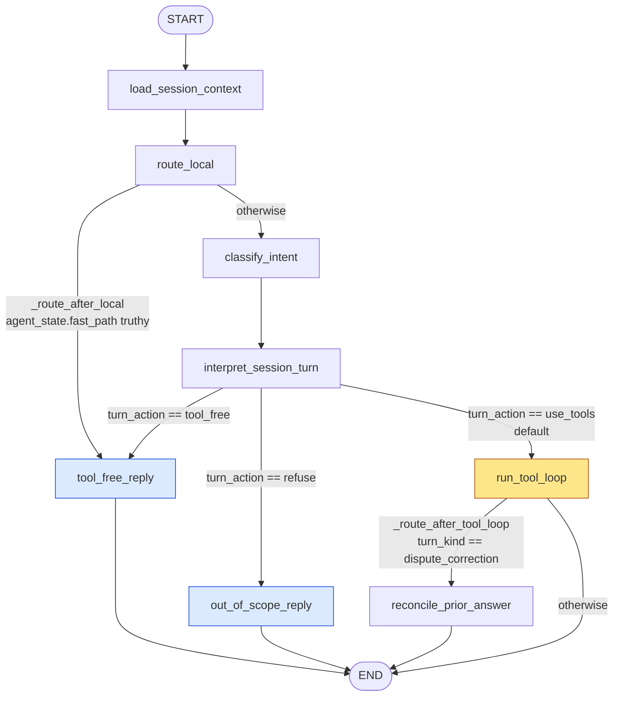
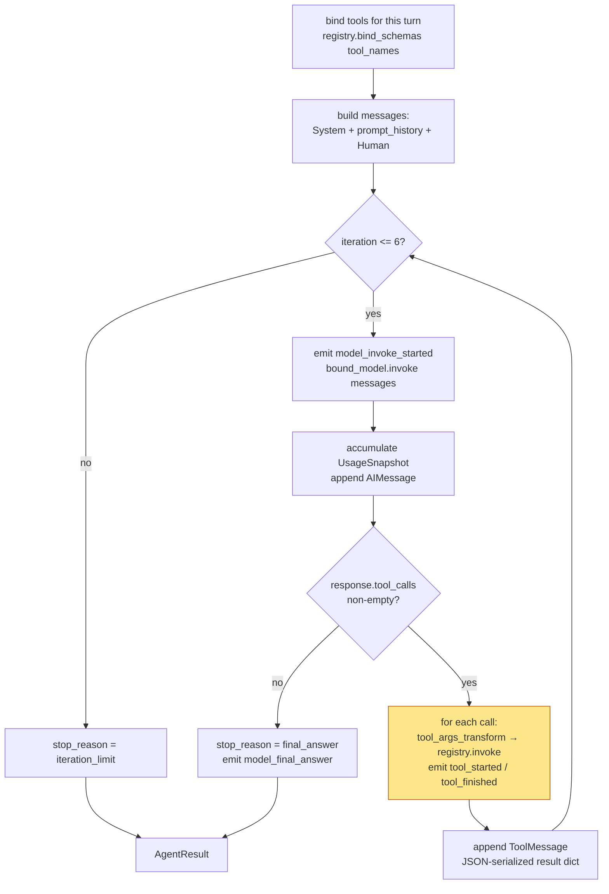
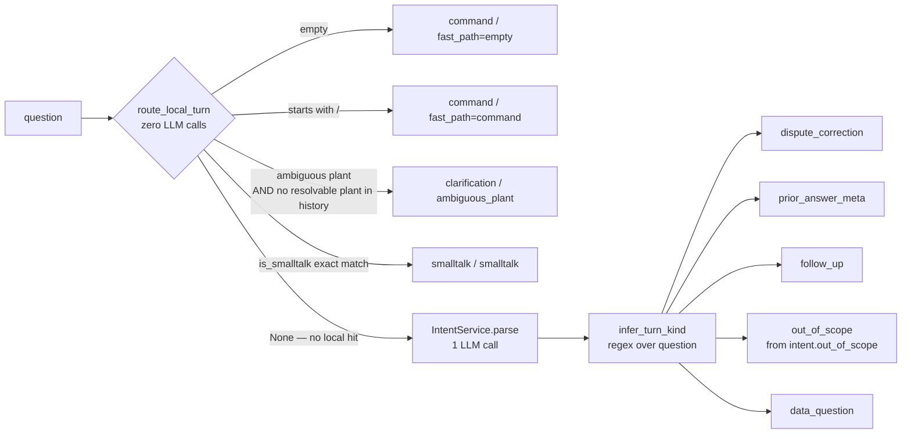
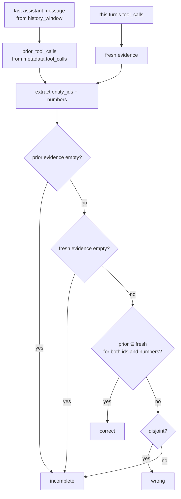
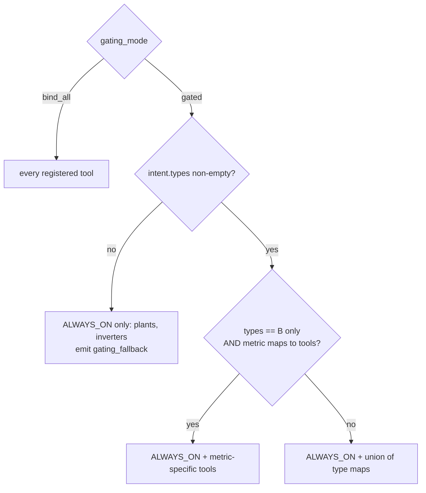

# Snapshot — the AI-agentic loop graph as it exists today

> ## ⚠️ This is a snapshot, not a specification.
>
> **This document describes what the code *does*, not what it *should* do.**
> Nothing here is a decision, a target, a contract, or a requirement. It is a
> read-out of the implementation at a point in time, produced for orientation
> and discussion.
>
> - **Do not** treat anything below as intended or endorsed behavior.
> - **Do not** implement toward it, restore code to match it, or cite it to
>   justify keeping something as-is.
> - **Do not** update it to "keep it in sync" — when it drifts it is simply
>   stale, and a stale snapshot is fine. Re-derive a fresh one instead.
> - Several things it documents are known workarounds, duplication, or
>   scaffolding. Being described here is not an argument that they are right.
>
> Decision truth lives elsewhere: `docs/requirements/` (expected behavior),
> `docs/design/` (architecture, intent), `docs/adr/` (durable decisions).
> Where this snapshot and those disagree, **those win and this is wrong.**
>
> Implementation truth is the code itself:
> `app/ai/agent_graph.py`, `app/pipeline.py`, `app/ai/agent_loop.py`,
> `app/ai/turn_router.py`.

**Snapshot taken:** 2026-07-25 · **Commit:** `d80b1cf` · **Branch:** `agent-redesign`

Related design docs — read those for intent, not this one:
`docs/design/full-react-agent-redesign.md` (where the agent is meant to go),
`docs/design/architecture.md` (module inventory). Note one conflict observed
while writing this snapshot: `architecture.md` states "There is **no LangGraph
`StateGraph`**", while the runtime now compiles one (`compile_runtime_graph`).
That is flagged as a discrepancy to resolve in the design docs — this snapshot
does not settle it.

---

## 1. Two nested loops, not one

The system has **two distinct layers**, and it matters which one you mean by
"the agentic loop":

| Layer | Where | Engine | Shape |
|---|---|---|---|
| **Outer: turn graph** | `agent_graph.compile_runtime_graph` | LangGraph `StateGraph` | DAG — no cycles. One pass per user turn. |
| **Inner: tool loop** | `agent_loop.run_agent_loop` | Hand-rolled `for` loop over LangChain | Cyclic ReAct — invoke → tool calls → append → repeat, ≤ 6 iterations |

The outer graph decides *whether and how* to think; the inner loop does the
actual ReAct reasoning. The inner loop is a **single node** (`run_tool_loop`) of
the outer graph — deliberately, so tool gating is just "a different
`tool_names` list" and the loop body stays identical.

---

## 2. The outer graph



Eight nodes, three conditional edges, three terminal branches. Compiled fresh
**per `Pipeline.answer()` call** — the node closures capture `session_id`,
`provider_id`, `normalized_gating`, `reference_now` and the `emit` callback from
the enclosing request scope, which is why the graph is not a module-level
singleton.

### Node reference

| Node | Implementation | Reads | Writes into `PipelineRuntimeState` |
|---|---|---|---|
| `load_session_context` | `pipeline.py` closure → `build_agent_graph_state` | `question`, session store | `agent_state` |
| `route_local` | → `turn_router.route_local_turn` | `question`, `prompt_history` | `agent_state`, `intent`, `intent_meta`, `fast_path`, zeroed `intent_usage` — **or `{}`** (no-op) |
| `classify_intent` | → `IntentService.parse` + `infer_turn_kind` + backfills | `question`, `prompt_history` | `agent_state`, `intent`, `intent_meta`, `intent_usage`, `intent_model_name` |
| `interpret_session_turn` | → `derive_turn_interpretation` | `agent_state` | `turn_interpretation` |
| `tool_free_reply` | → `build_tool_free_reply` / `_build_prior_answer_meta_reply` | `agent_state` | `answer`, `stop_reason`, `fast_path` |
| `out_of_scope_reply` | → `_build_out_of_scope_reply` | `intent`, `question` | `answer`, `stop_reason` |
| `run_tool_loop` | → `run_agent_loop` (the inner loop) + answer overrides | `agent_state`, `intent` | `answer`, `stop_reason`, `tool_calls`, `bound_tools`, `iterations`, `synthesis_usage/model`, latency |
| `reconcile_prior_answer` | → `apply_prior_answer_verdict` | `agent_state`, `tool_calls` | `agent_state`, `prior_answer_verdict` |

### Routers

All three are pure functions over the state dict — `app/ai/agent_graph.py:456-477`.

```python
_route_after_local      # fast_path set?          -> tool_free_reply | classify_intent
_route_after_interpret  # turn_interpretation     -> tool_free_reply | out_of_scope_reply | run_tool_loop
_route_after_tool_loop  # turn_kind==dispute_...  -> reconcile_prior_answer | END
```

`_route_after_interpret` defaults to `use_tools` when `turn_interpretation` is
missing — a missing interpretation fails **open** into the tool loop, not closed
into a refusal.

---

## 3. The inner ReAct loop

`app/ai/agent_loop.py` — `MAX_TOOL_ITERATIONS = 6`.



Details worth knowing:

- **Tools are bound per call, not per process.** `bind_schemas(tool_names)`
  runs on every turn, so gating is a data change, not a code path.
- **Anthropic gets cache breakpoints.** When `is_anthropic_model(model)`, the
  system prompt becomes a single `cache_control: ephemeral` text block
  (`system_blocks_with_cache`) and the **last** tool schema is marked as a cache
  breakpoint (`tool_schemas_with_cache`). Everything before the breakpoint —
  system prompt + schema card + all tool definitions — is the cached prefix.
- **Tools never raise into the loop.** `ToolRegistry.invoke` catches every
  exception and returns `{"ok": False, "error": ...}`; unknown tools and
  invalid args (validated against the handler's real Python signature) return
  the same shape. The model sees the error as a ToolMessage and can recover
  within the remaining iterations.
- **Results are structured dicts, JSON-serialized deterministically**
  (`sort_keys=True`, compact separators) — which keeps the ToolMessage prefix
  stable across turns and cache-friendly.
- **`stop_reason` is only ever `final_answer` or `iteration_limit`.** The
  outer node maps an empty-answer `iteration_limit` to `_ITERATION_LIMIT_REPLY`
  and emits `synthesis_degraded`.

---

## 4. Turn taxonomy — the thing that drives every branch

`TurnKind` (8 values) is the central classification. It is decided in **two
places** with different costs:



`route_local_turn` returning `None` is the signal "I have no opinion, pay for
the LLM". Everything it *does* answer costs zero tokens and zero latency —
`intent_usage` is an empty `UsageSnapshot()` and `intent_meta.latency_ms = 0`.

| `turn_kind` | Terminal path | LLM calls |
|---|---|---|
| `smalltalk`, `command`, `clarification` | `tool_free_reply` (via local fast-path) | 0 |
| `prior_answer_meta` | `tool_free_reply` (via interpret) | 1 (intent) |
| `out_of_scope` | `out_of_scope_reply` | 1 (intent) |
| `data_question`, `follow_up` | `run_tool_loop` | 1 + 1..6 (synthesis) |
| `dispute_correction` | `run_tool_loop` → `reconcile_prior_answer` | 1 + 1..6 |

Note the asymmetry: `follow_up` and `dispute_correction` **override**
`out_of_scope` in `plan_graph_nodes` — a follow-up is never refused for scope,
because the scope signal was computed against the unresolved (pronoun-laden)
question.

---

## 5. `interpret_session_turn` — the structural seam

Added by AR-1 as a deliberate **no-op-shaped insertion point**
(`derive_turn_interpretation`, `agent_graph.py:347`). Today it makes **no LLM
call** — it projects already-classified state into a typed envelope:

```python
TurnInterpretation = {
    "turn_action": "use_tools" | "tool_free" | "refuse",
    "resolved_request": str,   # resolved_question or raw message
    "intent": dict,
    "tool_policy": str,        # the gating mode
}
```

The point: routing now reads `turn_interpretation["turn_action"]` rather than
sniffing `turn_kind` directly, so a future session-aware semantic interpreter
can be dropped in behind this function without touching the graph topology or
any router. The docstring says exactly this.

---

## 6. Two state objects — know which is which

There are two, and they are not the same thing.

**`PipelineRuntimeState`** — a `TypedDict`, the LangGraph channel schema. Nodes
return partial dicts; LangGraph merges them. This is the graph's state.

**`AgentGraphState`** — a mutable `@dataclass(slots=True)`, carried *inside*
`PipelineRuntimeState["agent_state"]` as a single opaque channel value.

```python
@dataclass(slots=True)
class AgentGraphState:
    latest_user_message: str
    session_id: str
    history_window: list[SessionHistoryMessage]   # with metadata
    prompt_history: list[PromptHistoryMessage]    # prose only
    turn_kind: TurnKind = "data_question"
    intent: dict
    fast_path: str
    resolved_question: str
    prior_answer_verdict: PriorAnswerVerdict | None
    graph_nodes: list[GraphNodeName]              # the *planned* path
    turn_interpretation: TurnInterpretation
```

Gotcha: because `AgentGraphState` is mutable and passed by reference, nodes
mutate it in place *and* return it as an update (`interpret_session_turn_node`
does both). That works, but it means the dataclass is not a value-typed channel
— don't add a reducer to it expecting immutable semantics.

### `graph_nodes` is a plan, not a trace

`plan_graph_nodes` (`agent_graph.py:370`) computes the node sequence the turn
*should* take, purely from `(turn_kind, has_session_context, has_fast_path,
out_of_scope, tool_free)`. It is stored in `intent_meta.graph_nodes` for
telemetry and assertions. The **actual** execution path is reported separately
by the `graph_node_started` / `graph_node_finished` trace events. Keeping both
lets tests assert that the declarative plan and the executed graph agree.

---

## 7. History: two projections of the same messages

`load_session_context` pulls both from the SQLite session store:

| Projection | Content | Consumed by |
|---|---|---|
| `history_window` | full message dicts incl. `id`, `created_at`, `metadata` (tool_calls, `evidence_fingerprint`) | `reconcile_prior_answer`, `prior_answer_meta` replies |
| `prompt_history` | `{role, content}` prose only | the inner loop's message list, follow-up resolution, intent context summary |

Both go through `bound_history_window` (`context_budget.py`), which enforces a
three-way budget applied **newest-first**:

- `AI_CONTEXT_MESSAGE_LIMIT = 40` messages
- `AI_CONTEXT_HISTORY_CHAR_BUDGET = 16000` chars total
- `AI_CONTEXT_SINGLE_MESSAGE_CHAR_LIMIT = 4000` chars per message

Two subtleties: an over-budget message is **skipped, not truncated to fit** —
older short messages can survive while a mid-sized one is dropped; and the
**latest message is always kept** regardless of budget (`is_latest` bypass).
Individual over-long messages get head-truncated with the tail preserved
(`[earlier message truncated for context budget]` + last N chars) — the tail
matters because the conclusion of an answer is usually at the end.

The prompt-history projection deliberately **strips metadata**, so tool
evidence never leaks back into the model's conversational context — evidence
re-enters only through fresh tool calls. That's what makes the dispute
reconciliation an *independent* re-check rather than a re-read.

---

## 8. Follow-up resolution — string rewriting, no LLM

`resolve_follow_up_question` (`agent_graph.py:177`) rewrites the question into a
self-contained one by prepending recovered context. Cascading rules, first match
wins:

| Trigger | Rewrite |
|---|---|
| `"how is the plant doing?"` + a plant in history | `"{metric anchor} Follow-up: {q}"` or `"How is {plant} doing?"` |
| starts with `and `/`what about `/`how about ` | `"{previous turn} Follow-up: {q}"` |
| bare affirmative (`yes`, `ok`, `sure`) or re-check phrasing | `"{prev user} {prev assistant} Follow-up request: {q}"` |
| contains `those`/`that one`/`previous`/`earlier`/`again` | `"{prev user} {prev assistant} Follow-up question: {q}"` |
| any history at all | `"Recent context:\n{last 3 turns}\nLatest follow-up: {q}"` |

The **metric anchor** search (`_latest_metric_anchor`) scans history backwards
for a message mentioning both the plant and one of `_METRIC_CONTEXT_CUES`
(performance ratio, daily yield, feed-in tariff, cloud cover, MTTR, …), user
messages before assistant ones. The resolved string is what reaches the tool
loop as `user_prompt`.

`_backfill_follow_up_intent` complements this on the intent side: it infers a
`metric` from the recovered context and force-clears `out_of_scope` for the
five recognized metrics — a follow-up should inherit its predecessor's scope.

---

## 9. `reconcile_prior_answer` — evidence-diff verdicts

Only reached for `dispute_correction`. It compares the **stored** tool evidence
from the last assistant message's metadata against the **fresh** tool calls this
turn produced, and emits a `PriorAnswerVerdict`.



Extraction rules (`_extract_entity_ids`, `_extract_numbers`):
- entity IDs come from `matched_inverter_ids`, `anomaly_ids`, and
  `anomalies[].{inverter_id, plant_id, anomaly_id}`
- numbers are harvested **recursively** from the whole result dict, including
  numeric-looking strings (comma-stripped), excluding booleans, rounded to 4dp
- comparison is set-based: subset ⇒ `correct`, disjoint ⇒ `wrong`, partial
  overlap ⇒ `incomplete`

The verdict also carries `evidence_fingerprint_sha256` copied from the prior
message's metadata (`stable_fingerprint`, a sorted-key SHA-256 of the payload),
so a verdict can be tied back to the exact evidence snapshot it judged.

---

## 10. Tool gating — what the model is even allowed to see

`_select_tool_names` (`pipeline.py:522`) runs inside `run_tool_loop`, before
binding.



- `_ALWAYS_ON_TOOLS = {plants, inverters}` — the entity-resolution floor. Any
  turn can look up who exists.
- Type maps: **A** = static/ops lookups, **B** = the full metric surface,
  **C** = anomaly-centric.
- The metric shortcut is the tightest binding: a pure-B turn with a known
  `metric` gets `plants + inverters + one metric tool`. That is the case
  Anthropic caching benefits from most, and also the case where the model has
  the least room to wander.
- Empty `types` is treated as classifier failure, not as "no tools needed" —
  it falls back to the minimal safe subset and emits a `gating_fallback` trace
  rather than failing the turn.

The returned list preserves **registry order**, not intent order — so the
"last schema" that carries the Anthropic cache breakpoint is stable for a given
tool set.

---

## 11. Prompt assembly, and the post-hoc answer overrides

The synthesis system prompt (`_build_synthesis_prompt`) is layered:

1. Role + hard constraint: *tools only, never invent numbers*
2. **Time anchor** — the branch that matters. With
   `use_reference_now_anchor`, "today"/"now" means the dataset's latest
   timestamp and the prompt says explicitly *"This is NOT the real-world date."*
   Without it, "now" is wall-clock and the prompt says *do NOT* anchor to the
   dataset.
3. Degradation instruction (say what's missing)
4. `_build_question_guidance(intent)` — **conditional, intent-keyed** micro-
   instructions. E.g. `metric == performance_ratio` injects three specific
   recipes ("performing worst right now" ⇒ `aggregate_by="plant",
   sort_order="asc", window="last_week"`, first result is the answer). This is
   how known-hard question families get pinned without bloating the base prompt.
5. The schema card (`build_schema_card()`), appended last.

Then, on the way out, `run_tool_loop` applies **deterministic overrides** to the
model's prose — narrow, question-shaped, and applied in order:

| Override | Fires when | Effect |
|---|---|---|
| `_maybe_override_weather_answer` | anchored mode + "today/now" weather question | replaces the answer entirely with a rendered snapshot from `latest_reading` |
| `_maybe_override_inverter_count_answer` | `"how many inverters does … have?"` | replaces with `"{plant} has {n} inverters."` from `matched` |
| `_maybe_annotate_single_plant_answer` | exactly one plant ID across all args+results | injects `(plant_id)` after the plant name, or appends `Plant ID: …` |

There is also `_normalize_tool_args_for_question`, passed into the loop as
`tool_args_transform` — it patches args *on the way in* (e.g. forces
`status="open"` for MTTR when the question says "open alert"). Note the
distinction: `setdefault` for hints, direct assignment where the question is
unambiguous.

Observed properties, stated without endorsement: the overrides are strictly
post-hoc, and every value they emit comes from a tool result already present in
`tool_calls` rather than being synthesized. They appear to exist to handle "the
model has the right data but phrases it wrong" — that is an inference from the
code, not a documented rationale.

---

## 12. Observability

Two event streams, both flowing to the same `event_handler`:

**Graph-level** (`graph_node` wrapper in `pipeline.py:207`) — emits
`graph_node_started` / `graph_node_finished` with `details.node` around *every*
node. These bypass the collected `trace_events` list (`emit_graph_event` only
calls the handler) so they stream live to the UI without bloating the stored
trace.

**Semantic** (`emit`, both collected and streamed):

| Event | From |
|---|---|
| `intent_started` / `intent_finished` | route_local / classify_intent |
| `follow_up_resolved` | classify_intent, when a rewrite happened |
| `session_turn_interpreted` | interpret_session_turn |
| `gating_fallback` | run_tool_loop, empty intent types |
| `synthesis_started` | run_tool_loop, carries the bound `tool_names` |
| `model_invoke_started`, `model_final_answer` | inner loop, per iteration |
| `tool_started` / `tool_finished` | inner loop, per call, with `latency_ms` and `ok` |
| `synthesis_degraded` | run_tool_loop, iteration-limit with empty answer |
| `reconciliation_finished` | reconcile_prior_answer, carries the verdict status |

Telemetry (`TelemetrySummary`) splits usage by stage — `intent_usage` vs
`synthesis_usage` — plus `tool_iteration_count` (total tool *calls*, not loop
turns) and `turn_latency_ms`. `UsageSnapshot` tracks `cache_read_tokens` and
`cache_creation_tokens` separately and derives `cache_hit_rate =
read / (read + creation)`, so Anthropic prefix-cache effectiveness is directly
measurable per turn.

Cache-creation extraction has a quirk worth knowing: it prefers the sum of
`ephemeral_5m_input_tokens + ephemeral_1h_input_tokens` and only falls back to a
flat `cache_creation` key — because LangChain surfaces the TTL-split form for
Anthropic.

---

## 13. Failure and degradation ladder

Nothing in this design raises to the user. Each layer degrades:

| Failure | Handled by | Result |
|---|---|---|
| Intent JSON malformed | `_invoke_with_repair` — 1 repair round-trip with the errors fed back | repaired intent, or empty intent + `parse_errors` |
| Intent empty after repair | `_select_tool_names` fallback | minimal tool set + `gating_fallback` trace |
| Tool raises / unknown / bad args | `ToolRegistry.invoke` | `{"ok": false, "error": …}` ToolMessage; model retries |
| Model won't converge | `MAX_TOOL_ITERATIONS = 6` | `stop_reason=iteration_limit`; empty answer ⇒ `_ITERATION_LIMIT_REPLY` |
| Question genuinely unanswerable | `out_of_scope_reply` | specific reply for revenue and forecast questions, generic otherwise |
| Ambiguous plant, no history | local fast-path | clarification question, zero LLM calls |

The `_invoke_agent_loop_compat` shim in `pipeline.py:509` filters kwargs against
`run_agent_loop`'s live signature — so an older or patched loop implementation
that lacks e.g. `event_handler` still runs. It exists for the replay/test
harness swapping loop implementations.

---

## 14. Coupling points observed in the current code

Not a to-do list and not guidance — just where the current structure is coupled,
which is the kind of thing a snapshot is useful for. Whether any of this *should*
stay this way is a design question this document does not answer.

- `derive_turn_interpretation` is currently the only thing standing between
  `turn_kind` and routing; its body is a projection, and the graph topology does
  not depend on how it is computed.
- `TurnKind` is declared twice — `agent_graph.py:10` and `turn_router.py:15` —
  as independent duplicated `Literal`s. Consumers of the kind are spread across
  `plan_graph_nodes` and `infer_turn_kind`.
- The outer graph has no back edges, and `PipelineRuntimeState` channels are
  last-write-wins with no reducers. Any cyclic path would interact with that.
- A tool absent from both `_TYPE_TOOL_MAP` and `_METRIC_TOOL_MAP` is
  unreachable in `gated` mode even when registered in `app/tools/`.
